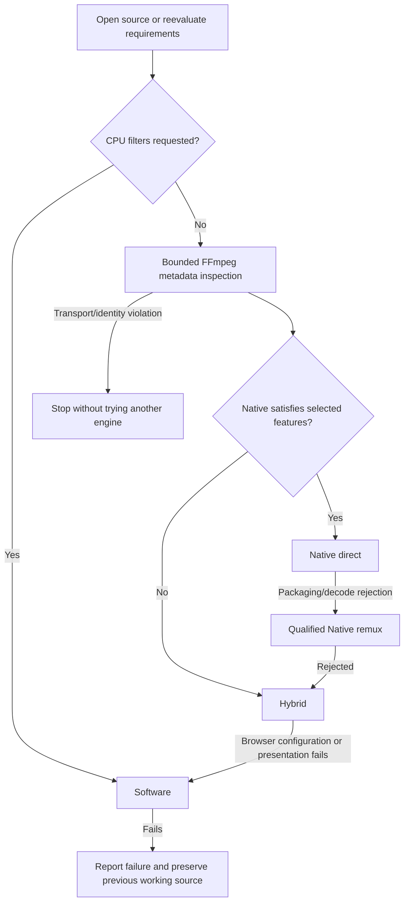

# Automatic playback selection

`new Player(host)` now selects the route automatically. The actual engine is still
one of **Native, Hybrid or Software**; automatic selection is a policy, not a fourth
mode. Explicit `mode` options retain the previous manual contract.

```ts
const player = new Player(host);
await player.open(file);                    // Inspect and select a working route.
await player.play();
console.log(player.mode);                   // native | hybrid | software
console.log(player.diagnostics.selection);  // Selected, skipped and failed attempts.
await player.setVideoFilters('hflip');       // Automatically reopen in Software.
await player.setVideoFilters('');            // Reevaluate the cheaper eligible routes.
await player.setMode('hybrid');              // Pin Hybrid, including future opens.
await player.setAutomaticSelection();       // Resume automatic selection/reselection.
```

`automaticSelection: true` explicitly enables the policy even when a `mode` option
is present. `automaticSelection: false` keeps manual selection. The demo and minimal
example expose a separate Automatic selection checkbox alongside the three modes.



## Selection and recovery

- Every new source starts at Native eligibility again, even if the previous source
  needed Software. CPU filters skip directly to Software.
- A packet-only FFmpeg probe discovers tracks before accepting Native. Enabled
  embedded subtitles require mpv rendering. Audio eligibility considers the selected
  track rather than rejecting a file for every unused track. Native uses conservative
  codec mappings and `canPlayType`; the actual Native open must still succeed.
- Native remux now attempts the [broader browser MP4 packet contracts](BROAD-ROUTING.md). No audio or video transcoding
  is introduced. Hybrid and Software retain their existing decoder/resource limits.
- Hybrid must deliver an actual retained frame; a browser capability probe alone
  is insufficient. A rejected Hybrid candidate automatically proceeds to Software.
- Successful replacement preserves position, pause/play intent, volume and rate.
  Automatic transitions map explicit track selections by source stream index.
  Transitions reject if that identity cannot be preserved; disabled audio/subtitle
  selections remain disabled. Explicit manual mode changes retain their ID-reset contract. If all candidates fail while opening a new source,
  the previous working player is retained.
- A later Native direct decode failure tries forced Native remux before Hybrid.
  A later Hybrid decoder failure proceeds to Software. Each failed session can
  schedule recovery only once; failures on a replacement are rechecked after the
  active recovery completes, so recovery proceeds forward rather than looping.
- Seek failures may proceed to the next engine at the requested target. Invalid
  seek requests reject without fallback. Enabling subtitles after opening with them
  disabled reevaluates Native eligibility. Automatic CPU-filter changes reevaluate
  the route as well.
- Source transport, authorization and representation failures stop the chain.
  Fallback must not replace an ETag-protected session with a new reader that silently
  accepts a different file. Existing range retry logic owns transport recovery.

`selectionchange` reports individual skipped, failed and selected routes. The bounded
`diagnostics.selection.attempts` list explains the latest selection operation.
`modechange` continues to report candidate loading, failure and readiness, and `mode`
continues to name only the active engine. Automatic filter capability flags indicate
that requesting a filter can trigger an engine change.

## Costs and limits

Automatic inspection loads the small remux FFmpeg Wasm module and uses two temporary
workers even when Native direct eventually wins. It performs no audio/video decoding
or encoding and terminates those workers after inspection. This adds startup work;
no new CPU-performance advantage is claimed. **Explicit Native mode still has the
Wasm-free direct path.** Full automatic inspection requires cross-origin isolation,
source permissions and the existing bounded HTTP Range contract (or a local File).
A server that cannot satisfy range inspection may require explicit Native playback.

Destruction interrupts module-import waits as well as active probe work.
The probe has a 20-second deadline and the existing bounded source/demux budgets.
It does not invent support for unknown native codec/profile mappings. When metadata
inspection is unavailable for a non-transport reason, Native is skipped and mpv
routes are attempted. Explicit HLS/DASH sources currently start with mpv because
this probe does not establish their Native track requirements; existing static-VOD
manifest restrictions apply. Explicit Native retains browser-native manifest playback.

External browser WebVTT tracks cannot yet transfer to mpv through this API. Automatic
selection therefore rejects a route that would discard them rather than pretending
it preserved subtitles. Native track APIs, mpv-specific track IDs, multichannel output,
HDR, PiP/remote destinations and exact color handling retain the limitations in the
[capability contract](MEDIA-ROUTING.md). This selector does not add new output fidelity
or codec guarantees. Local Files now use bounded reads in all worker-backed routes, including fallback
to Hybrid or Software above 32 MiB. The ArrayBuffer API remains size-limited.

The metadata preflight is deliberately conservative about embedded subtitles and
Native codec mappings. Language preference negotiation, track mapping when source stream identity is
unavailable, and audio-only conversion remain separate work.
Unsupported explicit track requests continue to reject; automatic selection does
not guess a different language or silently drop requested external subtitles.

## Implementation and validation

- `src/unified-player.ts`: policy, ordered attempts, transactional commit, recovery,
  explicit pinning, filter/subtitle reevaluation and cancellation.
- `src/internal/selection.ts`: selected-track Native eligibility.
- `web/source-probe.js`: temporary worker ownership, metadata deadline and cleanup.
- `native/remux/remux.c` / `web/native-remux-worker.js`: packet-only `rm_probe`, sharing
  the existing source adapter and FFmpeg module without requiring decoders.
- `web/native-remux-player.js`: source-error provenance retained for terminal failures.

```sh
npm run build
WEBMPV_REMUX_FFMPEG_DIR="$PWD/build/pipeline-qualification/ffmpeg-remux" npm run build:remux
npm run test:automatic-selection
npm run test:api
npm run test:remux-regressions
```

[Recorded checks](../results/automatic-selection/README.md) distinguish successful
playback tests, injected runtime-error policy tests, and remaining qualification limits.
