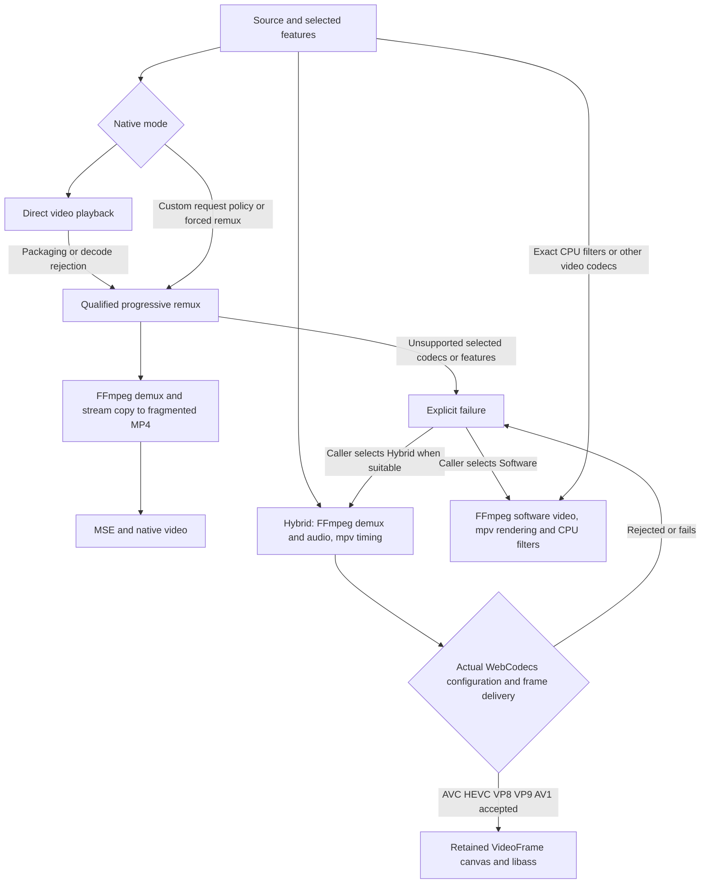

# Media routing integration

The subsequent [broad routing expansion](BROAD-ROUTING.md) supersedes the original
AVC/AAC remux and 1080p retained-source admission limits described below. Original
qualification results retain their original scope.

Native, Hybrid and Software remain the only public modes. This integration removes
Hybrid's H.264-only admission rule and adds a Native progressive remux plan. The subsequent [automatic selection policy](AUTOMATIC-SELECTION.md) now chooses
between those modes when the caller does not pin one. This is a development integration;
short functional playback checks do not constitute release or performance qualification.



## What changed and why

| Candidate | Decision | Integration boundary and remaining cost |
| --- | --- | --- |
| Broader Hybrid codecs | Implement | Codec-specific WebCodecs configuration and the existing mpv decoder mailbox; no new presenter or public engine. Codec/packet and seek regressions must accompany additions. |
| Progressive Native remux | Implement for qualified AVC/AAC | Maintained FFmpeg worker, independent bounded source worker and MSE controller; timeline, interruption, stream changes and MSE behavior are the main maintenance surface. |
| Native ASS overlay | Defer | Native still exposes browser text tracks; choose Hybrid for libass features. Embedding ASS in a remux does not make the browser render it. |
| Audio-only transcoding | Defer | Requires explicit quality/channel policy and encoder priming/sync qualification. No audio is transcoded here. |
| Software GPU renderer | Experiment further | Previously qualified prototype remains separate; this task preserves the current Software renderer. |
| Generated media track presenter | Defer | Does not expand compressed codec support or provide seekable VOD semantics. Existing retained canvas remains. |
| Small Hybrid GPU effects | Defer | Independent of codec admission. Exact CPU filters continue to require Software. |

[Decoder bridge](../native/vd_browser.c) selects AVC, HEVC, VP8, VP9 and AV1. The
[configuration helper](../web/video-codec-config.js) supplies each registration's
packet contract. AVC/HEVC distinguish configuration-record length-prefixed packets
from Annex B; AV1 supplies configuration OBUs in the compressed stream, not a
`description`; VP9 can derive profile/depth from its first key packet when WebM
omits that metadata. These operations do not decode or re-encode compressed media.
The [retained worker](../web/retained-decoder-worker.js) probes the actual configuration
and the public player waits for a presented frame before committing a candidate.
A transient unselected video track no longer counts as audio-only readiness.

The Hybrid link now uses the existing expanded FFmpeg demux/audio archives, including
AC-3, Vorbis and Opus exercised in this suite. This is not a claim that every registered
FFmpeg component or browser codec configuration plays correctly. Retained browser
frames do not copy their video planes back into Wasm. There is still a compressed
packet copy, GPU/compositor work, a six-byte timing placeholder and subtitle bitmap
composition. The tests do not establish hardware decode or zero-copy rendering.

Packet admission uses the actual decoder queue plus retained output queue, allowing
invisible packets instead of assuming one packet produces one displayed frame.
Submission stops at eight queued requests/frames; a 32-frame hard output bound
allows asynchronous reorder bursts. The presenter separately retains at most 16
frames. Resource-limit failures remain explicit. Hybrid video remains bounded to
1920×1080; opaque/10-bit browser frames are accepted without assuming I420 output.
An accepted 10-bit frame is not HDR output qualification.

TS seeking uses up to 30 seconds of demux preroll and skips dependent packets before
a keyframe. Identical repeated codec extradata is accepted; changed configuration
still fails. This fixes the tested Annex B TS seek but can increase seek work.
Streams needing longer preroll, unusual random-access behavior, dynamic configuration
or unsupported color requirements still need further qualification or Software.

## Native plan contract

```ts
const player = new Player(host, {mode: 'native', nativeRemux: 'auto'});
await player.openRemote({url, headers: {Authorization: `Bearer ${token}`}});
await player.play();
```

`auto` tries direct playback and remuxes on media decode/format error codes 3/4.
Custom headers, authorization renewal and source policies which `<video>` cannot
enforce route immediately through the remux source. Generic network failures do
not trigger speculative remux. `never` opts out; `always` forces remux qualification.
A successful direct file still loads no Wasm. This is not a complete media probe:
a browser that silently omits an unsupported track may not report a direct error.
The automatic policy now preflights selected-track requirements; explicit Native
still leaves those requirements to the caller.
Native does not promise mpv subtitle, HDR or multichannel behavior.

[Remux C](../native/remux/remux.c), [controller](../web/native-remux-player.js),
[mux worker](../web/native-remux-worker.js) and
[source worker](../web/native-remux-source-worker.js) promote the existing qualified
prototype while leaving its original sources and measured artifacts unchanged.
The maintained additions expose demuxed audio track IDs, relative worker assets,
public source-time controls, authorization renewal, candidate failure isolation and
cleanup. Selected audio changes reopen the remuxer at the source position; incompatible
selection rejects and attempts to restore the previous selection.

The current admitted remux subset is selected **8-bit 4:2:0 AVC plus AAC-LC mono or
stereo**, qualified with MP4, indexed MKV and MPEG-TS. Both tracks are currently
required. Other compiled demuxers are not a blanket support guarantee. AAC ADTS to
ASC and AVC packet framing are representation adaptation; neither re-encodes audio
or video. No codec extensions are stripped and no channels are silently downmixed.
Changing codec parameters, unsupported reorder/timeline state or resource bounds
reject. Native remux is for random-access files, not a new HLS/DASH manifest engine.

The muxer emits an initialization segment and custom approximately 0.5-second
fragments. Fragments can begin within a GOP; seek restart must begin at a verified
IDR and decode the required preroll. MSE receives original timeline relationships
with a one-second positive mux bias to accommodate negative DTS. Public `time-pos`,
`duration`, `seek` and added WebVTT cues use source time. The exposed raw video
`currentTime`/`duration` includes that internal bias; use public controls. Audio/video
offsets and PTS/DTS reordering must not be replaced by restarting each seek at zero.

Production is pull-driven: one output batch in flight, MSE update completion before
the next append, five seconds forward or 12 MiB compressed retention before stopping.
A batch may overshoot these thresholds (8 MiB hard batch bound); long-GOP preroll
can exceed five buffered seconds. Eviction uses known random-access points, retaining
roughly three seconds behind. The source cache is 2 MiB, source blocks 64 KiB, Wasm
heap 64 MiB initially/128 MiB maximum, and demux index metadata capped at 4 MiB.
MSE/browser decoder memory is not measured by these application bounds.

Seek restart invalidates the old generation, cancels source work, replaces MSE,
seeks the original source and appends useful bounded target data. Public API calls
are serialized: a storm of public `seek` calls completes in order rather than
coalescing all requests into the last one. Thus correctness is tested, but obsolete
public requests still incur work. Cancellation counters report observed pending
bytes and an in-flight upper bound, not exact bytes lost inside a terminated worker.
Short sources may be fully remuxed within the forward-buffer budget; full-file
processing is not a prerequisite for a long source to begin playing.

External WebVTT is supported, including a cue active before the seek target.
Embedded ASS extraction/overlay is not part of this Native integration. Fullscreen,
PiP, remote playback, source representation changes, arbitrary edit lists and color
fidelity remain subject to the prior qualification limits and browser behavior.
The integrated MKV runs contain FFmpeg timestamp-rounding warnings; these short
checks do not prove sample-exact AAC priming or arbitrary edit-list equivalence.

## Reproduce

Use the checkout's pinned FFmpeg/mpv sources, Emscripten 4.0.14 and existing build
prerequisites. `scripts/link-hybrid.sh` consumes `build/obj-software-full-ffmpeg`,
`build/prefix` and the retained subtitle player's objects. Those prerequisites are
built by the existing Software and retained-subtitle build workflows; this is not
yet a standalone clean-machine packager. The new outputs are `web/engine-hybrid`
and `web/engine-remux`, preserving the older retained engine and qualification Wasm.

```sh
npm run build
npm run build:hybrid
npm run build:remux
# The integration run reused already qualified FFmpeg archives, read-only:
WEBMPV_REMUX_FFMPEG_DIR="$PWD/build/pipeline-qualification/ffmpeg-remux" npm run build:remux
npm run test:media-routing
npm run test:api
BROWSER=firefox CASES=native-direct,h264,hevc-ac3,vp8-vorbis,vp9-opus,av1,hevc-10bit,native-mkv-forced node tests/media-routing.mjs
```

Fixtures use the existing Software/full-format and pipeline qualification generators.
The integration harness serves the maintained public API and new engines, not the
prototype player. Preserve those fixture trees when reproducing existing results.
See [exact artifacts, measurements and preservation audit](../results/media-routing-integration/README.md).
The previous [qualification findings](PIPELINE-QUALIFICATION.md) and
[performance record](../results/playback-performance/README.md) remain historical
evidence; their endurance/CPU outcomes have not been relabeled as tests of this build.

## Source basis

- [WebCodecs registry](https://www.w3.org/TR/webcodecs-codec-registry/): registrations describe codec contracts; implementations need not support every codec.
- [AV1 registration](https://www.w3.org/TR/webcodecs-av1-codec-registration/): low-overhead OBU input and no configuration `description`.
- [HEVC registration](https://www.w3.org/TR/webcodecs-hevc-codec-registration/): configuration records versus Annex B input.
- [VP9 bitstream specification](https://storage.googleapis.com/downloads.webmproject.org/docs/vp9/vp9-bitstream-specification-v0.7-20170222-draft.pdf): first-keyframe profile/depth parsing; the local pinned FFmpeg `libavcodec/vp9.c` confirms the syntax.

The smallest useful architecture is the existing three modes with source and
packet adaptation behind their current boundaries. Expand admission with real
configuration/frame/seek checks; avoid a new public engine for every packaging plan.
