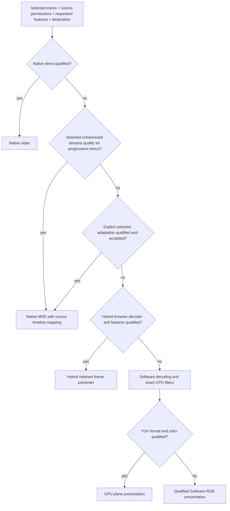

# Pipeline qualification and correctness

This continues the [pipeline investigation](PIPELINE-SEPARATION-FINDINGS.md). The original report and artifacts are preserved as historical evidence. Only the two existing experiments are extended: progressive Native remux and Software YUV GPU presentation. Production defaults and public Native/Hybrid/Software modes remain unchanged.

The [qualification record](../results/pipeline-qualification/README.md) identifies exact runs, failures, corrected implementations, measured boundaries and commands. These are qualified experimental subsets, not universal container, browser, HDR or destination support.

## Correctness changes

**Native remux:** selected AVC/AAC streams are probed without linking decoders or encoders. SPS parsing validates the qualified pixel format and reconstructs bounded missing MKV DTS. ADTS AAC configuration and sample-count timing are adapted without changing AAC payload. MPEG-TS seeking verifies an actual IDR before the target, with bounded backwards search and a byte-zero restart when timestamp seeking would skip the first IDR. Changed in-band SPS/PPS is rejected. Source identity, refreshed authorization, retries, cancellation and output backpressure stay in the source/remux boundary. Superseded SourceBuffer errors cannot cancel the current generation; post-destroy seeks reject without allocating workers.

A one-second internal MSE timeline bias preserves negative decoder preroll. The library maps positions, duration, buffering and seeks back to source time. Restarting each muxer at zero is incorrect. Raw native media controls expose the internal bias and need an explicit UI integration before promotion. More than one second of negative preroll, arbitrary configuration transitions, unsupported selected codecs, ASS and exact CPU filters do not qualify for this experimental Native plan.

**Software presentation:** SDR 8-bit YUV420P planes go from FFmpeg software decoding to three reusable GPU textures. BT.601/709 matrix/range conversion and quarter-turn rotation occur in the shader. ASS uploads cover the union of changed and previous subtitle bounds. Existing RGB software rendering handles qualified other formats; rotated fallback formats fail explicitly until a qualified CPU transpose is selected. Context loss pauses playback, rebuilds resources, restores pause state and redraws. Canvas PNG extraction is exercised by the paused redraw checks; readback is an explicit screenshot operation, not part of steady presentation. Rendering exceptions return through mpv's locked call before reporting failure.

**Source cancellation:** qualification exposed an existing asynchronous epoch race: a late cancellation notification could abort the next source read. The experimental IO worker synchronizes against the native epoch before starting a request; duplicate late notifications do not abort it. The experimental C bridge reserves the exact pending ticket atomically before advancing the epoch. This is isolated from the maintained source worker/bridge and has a baseline-failing regression reproduction.

## Routing stays internal

Choose an eligible plan before loading an engine. Prefer compatible alternate selected audio tracks before proposing conversion. A remux failure must be surfaced with its reason and permit deliberate Hybrid/Software recovery. Native owns its media clock; mpv remains the timing/audio/filter authority for Hybrid and Software.

| Candidate | Decision after this qualification |
|---|---|
| Selected-track/source/destination capability plan | Implement as the shared planning boundary |
| Progressive AVC/AAC remux | Keep opt-in; experimental subset qualified, broader timelines/configurations and native controls remain promotion gates |
| Software YUV GPU output | Implement a qualified optional presenter; preserve RGB fallback and review production integration before changing defaults |
| Source epoch/ticket fix | Implement as a separate correctness change after reviewing the isolated regression evidence |
| Native ASS overlay | Experiment further; existing Hybrid libass evidence does not qualify Native PiP/fullscreen |
| Audio-only conversion | Defer; quality/layout/priming/seek qualification remains required |
| Generated video track | Defer; no new evidence establishing VOD semantics or lower cost |
| Narrow Hybrid display effects | Implement only with explicit display-effect semantics; exact CPU filters retain Software routing |

The smallest production design remains one capability planner, one bounded-source contract, three playback modes, and internal presentation choices. Neither WebCodecs nor server transcoding becomes a requirement for Software or remux respectively.

## Performance interpretation

Fresh matched visible trials pass with no exposed drop-counter increments. Separate five-minute remux and YUV runs also pass, with bounded remux buffering, no YUV underruns and zero workers after cleanup. YUV uses less measured browser CPU than Software RGB for both the movie and animated ASS comparisons. Movie trial variability is large, so the observed 34% mean reduction is not a stable guarantee; the separate short ASS comparison is about 8%. Remux uses about 14% more CPU than Native direct in its own paired run. See the raw per-trial ranges and accounting limits in the qualification record; do not combine these with older runs.

## Maintenance and remaining boundaries

The remux build uses FFmpeg 7.1.1 private H.264 SPS interfaces. The YUV backend reuses mpv 0.40 private rendering structures and its RGB fallback. Both require version-pinned rebuild and qualification on upstream updates. Multiple initial SPS configurations, complex multi-edit timelines, discontinuous broadcast timelines, open GOP corner cases, very large indexes/GOPs beyond scan limits, HDR/high-depth GPU conversion and seamless configuration changes are not broadly certified.

GPU output still copies and uploads decoded planes; browser-internal copies are opaque. Worker-held memory and compressed queues can be bounded, but browser MSE/decoder/GPU allocation is not an exact application-owned byte count. WebKit automation is not a shipping Safari certification. Physical speaker/display synchronization, mobile platforms, PiP/remote playback and prolonged background/power transitions remain separate acceptance work.
