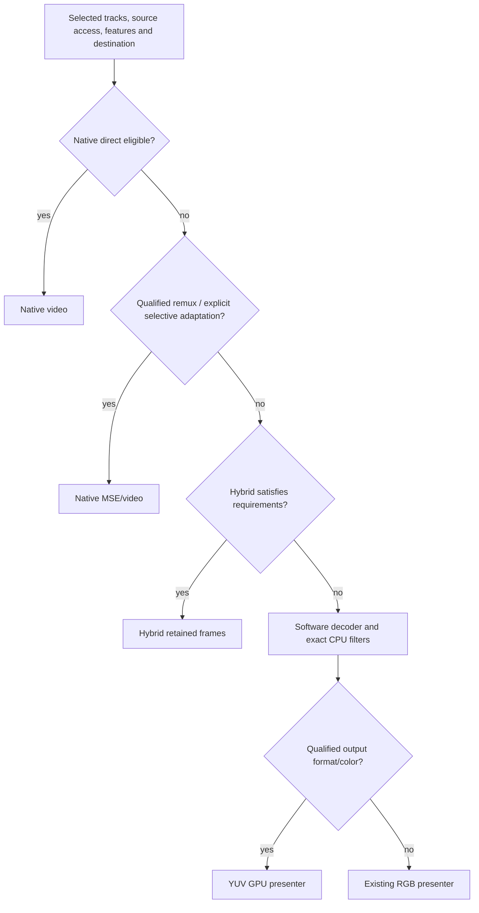

# Playback pipeline separation: findings

**Keep Native, Hybrid and Software. Prioritize a qualified YUV GPU presenter for Software; keep progressive Native remux experimental.** Two isolated prototypes were implemented without changing public modes, production defaults or maintained engine binaries.

The [detailed investigation and raw evidence](../results/pipeline-separation/README.md) covers source adaptation, remux timestamps/seeking, subtitles/audio, presenters, browser restrictions, correctness failures and measurement limits. It treats the [existing performance record](../results/playback-performance/README.md) and actual code as authoritative over older architecture proposals.

## What the measurements support

- **Software YUV output is promising.** A fresh matched visible movie run averaged 41.65% browser CPU versus 48.12% for current RGB Software output: 13.4% lower within that run. Both YUV trials passed; one baseline trial recorded one presentation drop. Animated ASS reduced the descriptive gain to about 4.8% in a separate short test. These small samples do not establish a production regression guarantee. [Movie evidence](../results/pipeline-separation/visible-2026-09-09T05-07-15.046Z/result.json), [ASS evidence](../results/pipeline-separation/visible-2026-09-09T05-12-36.383Z/result.json).
- **Remux is a compatibility/access capability, not a direct-play speedup.** Native averaged 5.58% browser CPU; remux 7.48% in the same paired run. First playable remux data arrived after 155–397 ms and 1.31–1.51 MB of a 248.8 MB source. Its application queue stayed at one, with a 2 MiB source cache and bounded output. [Evidence](../results/pipeline-separation/visible-2026-09-09T04-54-03.781Z/result.json).
- **The remux prototype is not ready to ship.** MP4 distant/backward seeks, seek storms, long GOPs, paused backpressure and large local MP4 pass. Indexed MKV fails missing-DTS handling; TS fails AAC configuration discovery; configuration changes and audio offsets remain unqualified. [Correctness matrix](../results/pipeline-separation/qualification-2026-09-09T05-03-51.559Z/result.json).

CPU uses browser-process CPU-time deltas, with 100% meaning one core; it excludes external compositor/media services. Tests used visible Chrome 152 on an AC-powered M1, matched media/audio/dimensions, and actual foreground checks. No hardware-acceleration, zero-copy, memory-saving or native-equivalent efficiency claim follows.

## Smallest useful routing architecture

Choose eligible plans from evidence; do not blindly try every route. Keep source identity/authentication/cancellation in the existing source owner. Native owns the media-element clock; Hybrid/Software retain mpv timing/audio/filter authority. Presentation is an internal choice, not another engine.

| Candidate | Decision |
|---|---|
| Shared bounded-source and selected-track planning contracts | Implement next |
| Progressive Native remux | Experiment further; resolve timestamps/configuration first |
| Native ASS overlay | Experiment further; qualify fonts, active-cue seeking and destination behavior |
| Optional audio-only conversion | Defer pending CPU, quality/layout, priming and A/V measurements |
| Software YUV GPU presenter | Experiment further; highest production priority |
| Generated video track | Defer optional presenter; reject as default replacement |
| Small Hybrid display effects | Implement narrowly; preserve exact CPU-filter fallback |

Software YUV currently supports only unrotated SDR 8-bit YUV420P with BT.601/709 conversion. It copies/uploads 3.11 MB per 1080p frame and has nonzero chroma/color differences from the baseline. ASS currently incurs full-overlay uploads. Native ASS, audio conversion, HDR, broad browser coverage and independent acoustic A/V timing remain unmeasured; the detailed report supplies the smallest follow-up experiments and maintenance boundaries.

**Reproduce and review:** [exact prototype files/build/test commands](../experiments/pipeline-separation/README.md). All prior benchmark artifacts and uncommitted work were preserved; [hash verification](../results/pipeline-separation/preservation-check.json) covers 1,841 pre-existing files. No commit or push was made.
