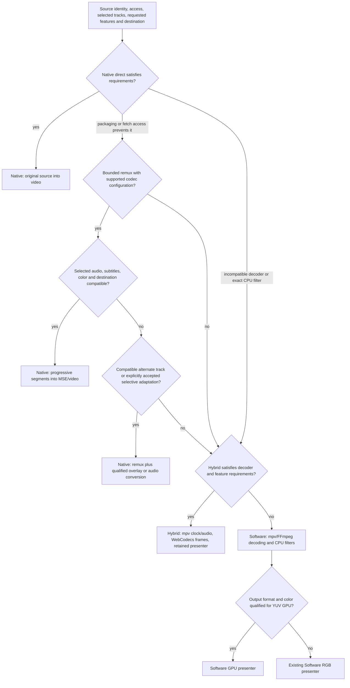

# Playback pipeline separation investigation

2026-09-09. Experimental work only; three public modes and production defaults are unchanged. No commit or push. Read this alongside the authoritative [performance record](../playback-performance/README.md), [integration contract](../../docs/INTEGRATION.md), [patch inventory](../../docs/PATCHES.md), and actual [public player](../../src/unified-player.ts). The older [architecture proposal](../../browser-player-feasibility-and-architecture-v3.md) predates several recorded successes and is not evidence that current Hybrid/Software capabilities are absent.

**Recommendation:** separate the internal source, adaptation, decoder and presenter contracts, while retaining Native, Hybrid and Software. Prioritize a qualified Software YUV presenter. Keep progressive Native remux experimental: the bounded MP4 proof works, but the current packet-only implementation fails important MKV/TS cases. Do not make remux an unconditional intermediate attempt or replace the retained-frame Hybrid presenter with a generated track.

## Evidence and scope

Actual code and preserved artifacts take precedence over API probes. Two major implementation experiments were built: **A, progressive packet-only remux**, and **C, Software decoding with GPU YUV presentation**. B, D and E received source review and bounded follow-up experiment designs; no audio-conversion or native-ASS performance claim is made. Chrome was tested on this machine only. Safari, Firefox, mobile, background playback, HDR and remote presentation remain unqualified.

The maintained Software engine disables FFmpeg muxers/encoders. It cannot simply be instructed to emit MP4. The current [Software worker](../../web/software-full-engine-worker.js) asks [native/player.c](../../native/player.c) for RGB0, copies a full frame to ImageData, fixes alpha and calls `putImageData`. The private mpv SW backend performs scaling/color conversion and subtitle composition on the CPU. The candidate bypasses that renderer, not the software decoder or mpv clock. Existing decoder SIMD optimizations are linked into both paths.

The current [Hybrid worker](../../web/filter-retained-engine-worker.js) retains browser VideoFrames and composes subtitles without returning video pixels to Wasm. Existing [generated-track](../../experiments/playback-performance/track/README.md) and [WebGPU](../../experiments/playback-performance/webgpu/) artifacts do not establish a repeatable whole-movie improvement over that presenter. Historical stage-removal and synthetic results are not combined with this investigation's visible measurements.

## Routing: plans inside three modes

This is a proposed capability planner, not currently implemented automatic routing. Choose a plan from positive evidence; skip known-ineligible routes. Cache source/configuration facts, not a universal assertion that an extension is playable. Native failures should have a bounded fallback deadline, not a sequence of expensive blind attempts. mpv provides broad compatibility, subject to the library's qualified codecs, filters, memory limits and platform constraints; it is not an unlimited catch-all.

Eligibility uses **selected** video/audio/subtitle tracks. An unused DTS or ASS track must not disqualify otherwise playable media. Prefer a compatible alternate audio track before asking for lossy conversion. Check exact codec profile, level, bit depth, configuration and channel layout; both media-element and MSE support matter. Capability queries are hints, not measured hardware acceleration or successful playback. [Media Capabilities specification](https://www.w3.org/TR/media-capabilities/).

Access is part of the plan: direct `<video>` cannot attach arbitrary application headers; readable remux inputs need suitable CORS and exposed Range/identity headers. Authentication refresh, redirect/origin policy, immutable identity, range validation and cancellation should reuse [RangeReader](../../web/range-reader.js). Opaque playable cross-origin URLs may be direct-only. No-range sources must be rejected or use a separately bounded sequential policy, never silently downloaded whole. Inline, fullscreen, video PiP, document PiP and remote playback have different overlay and source requirements. HDR and multichannel requirements must survive routing without silent SDR conversion/downmixing.

## Candidate decisions

| Candidate | Decision | Boundary and likely value | Maintenance / platform limits | Smallest useful disproof experiment |
|---|---|---|---|---|
| Shared source and selected-track plan contracts | Implement next, after API design | Reuse the existing RangeReader/engine owners; prevent needless decoding and repeated probing | Low–medium; authentication and cancellation remain source-owned | Same authorized source opened through direct/remux/Hybrid; verify identity and cancellation without a second cache manager |
| A: progressive Native remux | Experiment further | Small FFmpeg demux/mux worker feeding MSE; useful when packaging alone blocks native playback | Medium–high: timestamps, indexes, configuration, MSE eviction; needs isolated Wasm and readable source | MKV/TS with B-frames, distant seeks and bounded memory; current failures already disprove shipping this prototype |
| B: Native ASS overlay | Experiment further, after demux correctness | Independent libass renderer driven by media time; retain native decoding | Medium: font limits, subtitle history, worker packaging, fullscreen/PiP; no new engine mode | Animated embedded ASS with attached fonts; pause, backwards seek into an active cue, DPR resize and destination switches |
| B: audio-only conversion | Defer | Video stream copy; selected audio decoded/encoded only after explicit consent | High: encoder payload, priming, seek flush, layouts, quality and CPU | Matched visible H264 + incompatible audio vs alternate AAC vs conversion, with impulse sync and priming tests |
| C: Software YUV GPU output | Experiment further; highest production priority | Existing mpv scheduling/filters → decoded planes → reusable GPU textures | Medium private-mpv patch surface; current candidate is SDR 8-bit 4:2:0 only | Equivalent visible movie plus animated ASS, color tests and filter output; reject if upload/composition erases CPU benefit |
| D: generated video track | Defer optional presenter; reject as default replacement | Retained frames → writable track → video, without encoding | Nonstandard Chrome API and extra queue/clock boundary; no seekable-VOD semantics | Reuse existing track experiment for matched visible latency/CPU, background, pause/rate and A/V tests |
| E: small display effects | Implement narrowly after presenter contract | UV/geometry transforms for flip, crop, rotation, fit/zoom; explicit color effects | Low for geometry, medium for color; must preserve subtitle placement and output contract | Checkerboard/corner labels + active subtitles during seek/resize; compare exact requested behavior |

“Implement” denotes a recommendation, not a production change made here. CPU filters retain their exact semantics: an unsupported exact mpv/FFmpeg filter routes to Software. A display effect must not silently impersonate that filter.

## A. Progressive remux: implementation and correctness

[remux.c](../../experiments/pipeline-separation/remux.c) links an isolated FFmpeg 7.1.1 build with demuxers, MP4 muxing and bitstream filters, **no audio/video decoders or encoders**. It admits only H264/AAC, currently chooses FFmpeg's best tracks, and copies codec parameters/SAR. The 1,341,081-byte Wasm module is independent of mpv. [Source worker](../../experiments/pipeline-separation/source-worker.js) handles asynchronous RangeReader/File slices; a bounded shared mailbox supplies synchronous AVIO in a separate [remux worker](../../experiments/pipeline-separation/remux-worker.js). Neither synchronous AVIO nor mux work runs on the UI thread. This prototype requires cross-origin isolation/SAB; a resumable async AVIO design could remove that requirement at additional cost.

[RemuxPlayer](../../experiments/pipeline-separation/remux-player.js) is an experimental Native plan, not a fourth public engine. It emits `ftyp+moov` initialization, then `moof+mdat` fragments using `empty_moov+default_base_moof+frag_custom+frag_discont`. Each fragment is approximately half a second of packets; subsequent fragments may depend on earlier fragments. A new seek session must start with a usable RAP and retain decoder preroll. Independently decodable fragment boundaries would need RAP alignment, increasing latency/buffer size on long GOPs. The ISO MSE format requires appropriate initialization metadata, fragment decode times and relative addressing. [ISO BMFF MSE specification](https://www.w3.org/TR/mse-byte-stream-format-isobmff/).

**Timeline is not reset to zero on seek.** The worker seeks the original video stream backwards, creates fresh initialization/media output and preserves source PTS/DTS with a one-second positive mux bias; `SourceBuffer.timestampOffset = -1` restores the source timeline. `frag_discont` is needed because FFmpeg otherwise establishes a new local track origin. The candidate disables edit lists and rejects deeper negative preroll or missing DTS rather than inventing it. This is a narrow proof, not a general timestamp solution. Initial movie playback has a roughly 66 ms leading playable gap; readiness now tolerates that gap, without asserting sample-exact beginning behavior. [Pinned FFmpeg movenc source](https://github.com/FFmpeg/FFmpeg/blob/n7.1.1/libavformat/movenc.c).

A captured interval at 236.9 seconds was checked by compressed-packet SHA256 and PTS/DTS against the source, subtracting the explicit bias. An earlier `negative_cts_offsets` variant shifted video 66.667 ms relative to audio; that failed artifact is retained. The corrected interval preserves matched packet times. This does not qualify arbitrary edit lists, AAC priming, missing DTS, discontinuous clocks or track changes.

Backpressure allows one outstanding remux request and one pending compressed batch. The configured source cache is 2 MiB with 64 KiB reads; Wasm starts at 64 MiB and is capped at 128 MiB; single allocations cap at 16 MiB, metadata index target at 4 MiB, output batches at 8 MiB. Compressed buffer accounting stops production near 12 MiB, with at most one batch of overshoot. Fragment/seek/session/RAP diagnostics are capped. Copies include Wasm → JS compressed chunks, concatenation, transfer, and MSE ingestion; this is not zero-copy. JS concatenation temporarily duplicates a batch. Browser decoder/MSE internal memory is not exactly represented by the compressed ledger, and hard allocation limits can reject large metadata.

The forward target is five seconds. Eviction retains about three seconds **plus the current GOP**: removing at arbitrary times caused dependent-frame removal, stalls and excessive forward production. The correction removes only through a known past RAP. Long GOPs can make buffered seconds exceed the nominal target; bytes remain bounded, at the cost of rejecting/stalling a GOP larger than the budget. `segments` mode preserves timestamps; `sequence` mode would incorrectly make append order define time. Setting an append window directly at a seek target can discard the RAP/preroll. [MSE algorithms](https://www.w3.org/TR/media-source-2/).

Each seek increments a generation, cancels obsolete work, tears down both workers/MSE, seeks original media and appends useful bounded data around the destination. Old generations cannot append. This intentionally simple restart discards caches and even remuxes buffered destinations; production should retain useful intervals and reuse initialized workers. Pending discarded bytes are counted, but in-flight terminated-worker data is not observable: cancellation waste is a **lower bound**, not zero. RangeReader retries source reads before output; a failed/incomplete fragment must never be appended. Mid-fragment transport loss, changed ETag, auth refresh and quota recovery still require dedicated fault injection beyond the transient retry test.

For track/configuration changes, production must compare selected stream configuration, stop old append work, and supply a compatible new init or rebuild/changeType the SourceBuffer while retaining the destination timeline and preroll. The prototype does not do this. It also lacks production end-of-stream signaling/recovery and cannot resume cleanly after every fail-stop error. Subtitle seeks need cue-history/index access before the target; video keyframe seeking alone cannot recover a subtitle that began earlier.

### What can be remuxed without encoding?

| Source and selected codecs | Packet-only destination opportunity | Qualification here |
|---|---|---|
| MP4/MOV, AVC + AAC | Fragmented MP4; useful for controlled fetch/fragment access, not faster than direct | Movie/tail-index MP4 playback and seeks exercised |
| MKV, AVC/HEVC + AAC | fMP4 after configuration/timestamp adaptation, if exact browser codecs are supported | Indexed AVC/AAC MKV fails missing-DTS handling in this prototype |
| MPEG-TS, AVC/HEVC + AAC ADTS | fMP4 after framing/configuration extraction and AAC header adaptation | TS/configuration change fails; not qualified |
| MKV/WebM, VP9/AV1 + Opus | Suitable WebM segments or supported fMP4 codec mappings | Capability hints only; not implemented/tested |
| AVI/FLV with browser-compatible selected codecs | Possible after timestamp/index/configuration qualification | Not tested; demuxer registration is not proof |
| MPEG-2 video, unsupported H264 profile, unsupported selected audio | Packaging alone cannot make the codec supported | Hybrid/Software, alternate audio, or explicit selective conversion |

No frequency claim is justified without sampling the user's library. MKV alone is not evidence remux is needed: the preserved earlier host-remux experiment showed this Chrome could directly play its H264/AAC MKV fixture. Client remux should earn eligibility from an actual packaging/access mismatch.

Pure remux changes containers only. Annex-B versus length-prefixed AVC/HEVC and AAC ADTS-to-ASC are representation/configuration changes that need not re-encode samples. FFmpeg's `h264_mp4toannexb`/`hevc_mp4toannexb` go in the MP4-to-Annex-B direction, not a universal reverse conversion; the muxer and extradata handling matter. Configuration must be available before initialization is appended. The prototype's TS AVC codec-string fallback and hardcoded AAC-LC string are explicitly unqualified shortcuts. Core extraction is a separate feature-removing operation: `dca_core` removes DTS-HD extensions, `eac3_core` removes dependent substreams, and `truehd_core` removes Atmos extensions rather than converting TrueHD into AC3. Audio encoding is lossy at ordinary delivery settings. None should be labeled ordinary lossless remux. [FFmpeg bitstream filters](https://www.ffmpeg.org/ffmpeg-bitstream-filters.html).

## B. Native subtitles and audio adaptation

[JASSUB source](https://github.com/ThaUnknown/jassub) supplies a relevant independent libass integration: worker rendering, video-frame callbacks, resizing/DPR handling, font loading and packet-style subtitle processing. Its [worker implementation](https://github.com/ThaUnknown/jassub/blob/master/src/worker/worker.ts) accepts subtitle chunks/timecodes and font data. A Native integration should use the media element's presented media time, redraw explicitly while paused or resized, reset on seek/track changes, and preload bounded embedded/external fonts. Animated ASS/karaoke requires the full renderer and timing, not conversion to plain WebVTT. Font fallback, attachment identity, cache limits and font-ready redraw need explicit tests.

Our existing [subtitle extraction bridge](../../experiments/retained-subtitles/subtitles.c) exports rendered libass tiles tied to mpv's OSD state/clock; it is not a reusable native demux/cue-history API. Reuse its bounded tile/font policy and demux infrastructure, but do not run a second hidden mpv playback clock solely for Native subtitles. Current Hybrid already handles ASS under the owning mpv clock; Native adds a new synchronization boundary with unmeasured cost.

Fullscreen must target a wrapper containing video and overlay. Ordinary video PiP does not carry an arbitrary sibling DOM/canvas overlay; require a composited presenter, suitable text tracks or decline that combination. Document PiP can contain both elements where supported. Remote playback likewise needs receiver-compatible media/subtitles. [Video PiP](https://www.w3.org/TR/picture-in-picture/), [Document PiP](https://wicg.github.io/document-picture-in-picture/).

Audio-only conversion needs a separately built encoder component; the current full Software build does not provide encoders. Keep copied video packets unchanged, choose explicit codec/bitrate/layout, retain original track availability and disclose quality/channel changes. FFmpeg's AAC encoder sets 1024 samples of initial padding (21.33 ms at 48 kHz); a production mux plan must account for priming/trimming and not offset video independently. Seek must flush codec/resampler state, decode necessary preroll and preserve the source A/V offset. [Pinned AAC encoder](https://github.com/FFmpeg/FFmpeg/blob/n7.1.1/libavcodec/aacenc.c). CPU, first audible output, quality and multichannel behavior are **not measured here**; encoder availability alone does not justify this route.

## C. Software decoded planes to GPU

[yuv-backend.c](../../experiments/pipeline-separation/yuv-backend.c) replaces the private `render_backend_sw` symbol at link time, leaving upstream source and the maintained engine untouched. Existing mpv locking, scheduling and post-filter `mp_image` ownership remain intact. A synchronous callback reads the image while owned by mpv; JS keeps no pointer after the call. The existing public SW render API exposes rendered RGB, not decoded planes; directly adapting mpv's mature OpenGL backend would require its GPU/context/platform dependencies. This focused output path is smaller, but assumes responsibility for color/scaling correctness and carries a private-ABI maintenance burden. [mpv SW backend source](https://github.com/mpv-player/mpv/blob/v0.40.0/video/out/libmpv_sw.c).

[yuv.js](../../experiments/pipeline-separation/yuv.js) accepts SDR 8-bit YUV420P with BT.601/709 matrix and range information. Three reusable R8 textures perform GPU color conversion/scaling. Each 1920×1080 frame explicitly copies **3,110,400 bytes** from Wasm into reusable plane arrays and uploads those bytes in **three calls**. Baseline has an 8,294,400-byte RGB0 output, CPU conversion, ImageData copy and alpha pass. Driver/internal copies are unknown; there is no zero-copy claim. The candidate still allocates the unused legacy RGB buffer, so this prototype does not establish a memory saving.

Subtitles reuse the existing libass tile export and a separate overlay texture. The current implementation uploads a full 8,294,400-byte overlay when it changes; animated ASS could erase part of the saving. A production version should update bounded dirty tiles. Supported CPU filters run before presentation (hflip, vflip/negative stride and brightness were exercised). A filter producing an unsupported format must use the existing Software renderer, not an approximate substitute. Screenshots can read the final canvas explicitly outside normal playback; no per-frame readback occurs. Four textures and the program are deleted on destruction; context loss currently fails rather than recovering.

10/12-bit planar formats, NV12/P010, chroma siting, transfer/gamut management, HDR/tone mapping, arbitrary rotation and alpha are not qualified. Matrix/range conversion alone is not complete color management. The screenshot comparison with existing Software is **not bit exact**: channel MAE is approximately 1.23–1.72/255, with concentrated differences at chroma edges. Those differences require visual/color qualification before default use. They cannot be dismissed merely because a movie looks plausible.

## D. Generated track presenter

The current Chrome probe finds `MediaStreamTrackGenerator` on the window, neither generator API in a dedicated worker, and no standard `VideoTrackGenerator`. WebCodecs and MediaSource are available in the worker. Writing a cloned frame closes that clone while the original remains valid; queue desiredSize starts at one. The unloaded generated stream has no seekable ranges. These are capability/ownership results, not efficiency or decoder tests.

The standard [mediacapture-transform model](https://www.w3.org/TR/mediacapture-transform/) places VideoTrackGenerator in a dedicated worker and transfers frame ownership through a writable stream. Our existing Chrome experiment instead creates the nonstandard generator in the window and transfers its writable. mpv must still own source seek, playback rate and audio timing. Honor writer backpressure with a small pending-frame bound and close unused clones on cancellation. Pause/redraw requires retaining a frame independently; `<video srcObject>` does not supply the original file's VOD seeking or timing. A second presentation queue can add latency and A/V drift. Existing repository timestamp experiments also show that changing a wrapper timestamp need not change Chromium's underlying frame timestamp. Background/PiP/rate behavior remains to be measured with the actual browser version; native-direct efficiency cannot be inferred from the `<video>` element.

## E. Narrow Hybrid effects

Keep a presenter-level display transform separate from mpv's filter string: mirror/flip, crop, quarter-turn rotation and fit/zoom can alter texture coordinates or geometry without decoding again. Existing retained presentation already accounts for display geometry; avoid stacking conflicting transforms. Specify whether subtitles are transformed with the image or placed in output space. Color adjustments require an explicit SDR/HDR domain and cannot silently claim FFmpeg `eq` equivalence. Reuse the existing optional GPU presenter where useful, but the prior whole-movie results do not justify enabling a GPU pass for every frame by default.

## Smallest production architecture

1. Existing source owner supplies bounded random access, identity/auth refresh and cancel generations.
2. A selected-track planner returns a reasoned plan within Native/Hybrid/Software, including required quality changes and presentation-destination constraints.
3. Native owns either an original URL or a bounded segment producer; its media element owns playback time. Selective adapters are optional components with explicit consent/eligibility.
4. Hybrid and Software retain mpv's clock, audio, demux and filter authority. Presenters accept retained browser frames or owned-for-the-call software planes; they do not become a second scheduler.
5. Promote only individually qualified format/color/destination combinations. Retain the current renderer and fail explicitly where a requirement cannot be preserved.

This avoids a universal transcoder, a fourth playback engine and a second parallel playback manager. Source/adapter/presenter separation is valuable; each route still needs end-to-end correctness qualification.

## Reproduction and artifact provenance

[Exact prototype files and commands](../../experiments/pipeline-separation/README.md) describe both builds and every driver. [Fixture manifest](fixture-manifest.json) records construction commands and hashes. [Initial runtime manifest](runtime-manifest.json) records source/engine hashes for the first visible run; later harness fixes are documented separately from unchanged engine binaries. All earlier failures remain available and must not be counted as passing evidence.

Existing projects offer alternatives to owning all container code: [libav.js reader/writer devices](https://github.com/Yahweasel/libav.js/blob/master/docs/API.md) expose FFmpeg-style I/O but require application-owned buffering limits, while [Mediabunny streaming output](https://mediabunny.dev/guide/writing-media-files) is a focused JS media-container option. Neither removes timestamp, selected-track, source-identity or seek correctness requirements. Compare a maintained adapter against the custom worker before accepting permanent FFmpeg bridge maintenance; neither project is adopted here.

## Measurements and their limits

All visible comparisons use the same Apple M1 / 8 GiB Mac on AC power, installed Chrome 152, selected source audio enabled, 1920×1080 at 30 fps, 960×540 CSS display at DPR 1, and matched subtitles/filters within each run. The movie starts at 236.9 seconds. Each variant gets a fresh browser; foreground qualification checks document visibility/focus and the actual macOS foreground process. Screenshots are taken after the CPU interval. Browser launch/cache/startup variability is not controlled enough to rank startup speed.

CPU is the sum of CDP `SystemInfo.getProcessInfo` process CPU-time deltas divided by wall time; **100% means one CPU core**. Process churn is recorded/rejected. This excludes WindowServer, external VideoToolbox services and the localhost Node origin. RSS is a sum across reported browser processes, can double-count shared pages, and is not incremental allocation or GPU memory. No energy or hardware-acceleration conclusion follows. Browser flags disable background throttling; these are foreground tests, not background qualification. Raw process samples, source counters, A/V diagnostics, screenshots and cleanup are retained per trial.

### Native versus remux, one paired run

[Raw visible run](visible-2026-09-09T04-54-03.781Z/result.json), ten-second warmup and approximately thirty seconds per interval, order Native/remux/Software/YUV/YUV/Software/remux/Native:

| Plan | Browser CPU trials | Mean | RSS trials | First available video trials |
|---|---:|---:|---:|---:|
| Native direct | 4.67%, 6.50% | 5.58% | 953, 792 MiB | 956, 736 ms |
| Native remux | 6.13%, 8.83% | 7.48% | 969, 1154 MiB | 526, 309 ms |

These four trials passed the visible playback checks: approximately 30 fps, zero reported presentation drops, no process churn and no remaining workers. Remux costs about 1.90 percentage points of browser CPU on this already-native movie. Two repetitions are descriptive, not a statistical confidence interval. Startup is too variable and differently buffered to claim a remux latency advantage. The Software/YUV measurements in this same raw file are retained but their YUV qualification failed an observer bug (the worker belongs to a hidden iframe realm); they are not treated as a fully passing set.

For the two remux trials **in that same run**:

- First playable fragment window: 397 / 155 ms; cumulative source bytes before that point: 1,310,720 / 1,507,328 of 248,805,945. “Playable” is buffered target readiness, not first photon or first audible sample.
- Initialization plus generated bytes at readiness: 540,574 / 711,069. Largest generated batch during each trial: 754,716 bytes; actual individual sizes are in `stats.fragments`.
- End-of-trial cumulative fetched/generated bytes: 17,825,792 / 17,095,131 and 18,022,400 / 17,299,329 respectively. These include startup/warmup, not only the measured CPU interval.
- Peak compressed-buffer ledger: 6,146,762 bytes; peak buffered time: 16.43 seconds, reflecting GOP retention. MSE application queue depth: one. Cache peak: 2 MiB. Wasm heap: 64 MiB. Browser-internal coded/decoded memory remains opaque.
- No complete-file processing occurred for these movie trials. Their requested byte ranges cover only a small part of the source; no output file was materialized. Small fixtures can be entirely probed: the failed single-TS case consumed its whole 778,320-byte input. Bounded memory does not imply that every small source is only partially read.

### Software RGB versus YUV, fresh matched movie run

[Fresh visible run](visible-2026-09-09T05-07-15.046Z/result.json), order Software/YUV/YUV/Software, same movie/target/audio, no subtitles/filters, ten-second warmup and thirty-second measurement:

| Trial | Browser CPU | Mean RSS | Available frames/s | Reported drops | First available video |
|---|---:|---:|---:|---:|---:|
| Software 1 | 48.28% | 1122 MiB | 29.99 | 1 | 1051 ms |
| YUV 1 | 41.82% | 1114 MiB | 29.92 | 0 | 1000 ms |
| YUV 2 | 41.47% | 1264 MiB | 29.87 | 0 | 694 ms |
| Software 2 | 47.95% | 1335 MiB | 29.89 | 0 | 678 ms |

Means are 48.12% versus 41.65% browser CPU: a **13.4% descriptive reduction within this run**. Both YUV trials pass; the run as a whole fails its strict zero-drop condition because Software 1 reports one presentation drop. All four record zero decoder drops and audio underruns, maximum sampled absolute mpv A/V offset no greater than 12.1 ms, 16,515,072 cumulative source bytes, and zero workers after destruction. YUV explicitly reports zero live textures after cleanup. This is promising evidence, not a production qualification or a long-run regression guarantee. Do not pool these numbers with the earlier run's lower CPU values: that run had different observed operating variability and an incomplete cleanup check. Neither run establishes a memory saving.

The YUV raw counters include exactly three video uploads and 3,110,400 copied/uploaded bytes per frame, one initial blank subtitle upload in these subtitle-free trials, no application video readbacks and a 128 MiB Wasm heap. Counters are cumulative through teardown, whereas the CPU table uses only the measurement interval. The existing RGB output still allocates its full frame buffer in the candidate, a known prototype inefficiency.

### Animated ASS, separate short visible comparison

[Deadline-corrected ASS run](visible-2026-09-09T05-12-36.383Z/result.json) uses the existing 1080p `tracks.mkv`, embedded ASS/fonts, target 2 s, one-second warmup and approximately seven-second measurement. Order remains Software/YUV/YUV/Software. All four pass playback/foreground/cleanup checks, with zero reported decoder/presentation drops and audio underruns; maximum sampled absolute A/V offset is below 15 ms.

| Plan | CPU trials | Actual interval lengths | Mean RSS trials |
|---|---:|---:|---:|
| Software RGB | 53.10%, 54.79% | 7.107, 7.124 s | 1172, 1364 MiB |
| Software YUV | 50.51%, 52.18% | 7.003, 7.000 s | 1363, 1366 MiB |

The descriptive CPU mean reduction is about **4.8%**, much smaller than the separate movie run. This very short fixture, small interval mismatch and n=2 do not support a general animated-ASS performance claim. Each YUV trial records 34 full overlay uploads / 282,009,600 bytes by its final sample, in addition to video-plane uploads. Dirty-tile composition is therefore a meaningful next refinement to measure, not an assumed win. First available video ranges 760–986 ms across these four trials; physical audio startup remains unmeasured. The [earlier ASS run](visible-2026-09-09T05-11-04.191Z/result.json) is retained but had roughly 8.125 s Software versus 7 s YUV intervals; it is not used for the comparison above.

### Correctness results, separate from CPU comparisons

[Final remux matrix](qualification-2026-09-09T05-03-51.559Z/result.json) is **not wholly passing**:

| Case | Observed result |
|---|---|
| Tail-indexed MP4 at 236.9 s; seeks to 500 and 30 s | Pass; seek recovery 392 / 392 ms; 2,579,577 / 6,184,057 source bytes fetched in the new sessions |
| 20-second GOP; targets 19, 35, 1 and 18 s | Playback passes; seek recovery 195 / 65 / 200 ms on local HTTP; peak buffer about 26 s; large preroll cost remains |
| Six seeks at 20 ms spacing with delayed reads | First five reject with AbortError; final target 40 s becomes ready and plays; no remaining workers |
| Paused backpressure | Fetched bytes stay at 8,192,000 over the final three-second paused observation |
| Transient HTTP 503 | Retry case plays; no claim about a dropped mid-fragment connection or changed identity |
| Large local MP4 | 248,805,945-byte File opened via bounded slices; first available video 263 ms, without full materialization |
| Indexed / large local MKV | Fails with ERANGE on missing initial DTS; source ffprobe confirms N/A DTS at a RAP |
| Deliberate 250 ms audio-offset MKV | Same failure; offset preservation is not qualified |
| Rotation / sample aspect ratio | Playback passes; screenshots visibly preserve portrait rotation and wide aspect ratio; no exhaustive metadata audit |
| Single TS / concatenated resolution-and-timestamp change TS | Both fail before playback: packet-only probe lacks AAC sample-rate/channel configuration; transition logic is not reached |
| 10-bit MKV | Fails, but because of timestamp rejection; this is not a validated codec-profile eligibility check |
| Requested ASS on remux | Explicitly rejected; seek into active Native ASS is not implemented/qualified |

Seek timings are API-to-recovered-position/frame availability on local HTTP, not a network-latency forecast or physical presentation measurement. Recorded cancellation-discarded bytes are zero for observed pending batches, **not total cancellation waste**; aborted source/worker internals are not fully accounted. All matrix cases, including failures, leave zero page workers after teardown. The initial [matrix](qualification-2026-09-09T05-01-17.125Z/result.json) preserves the leading-gap readiness failures.

[Corrected packet capture](packets-2026-09-09T04-52-53.276Z/result.json) contains 694 packets, all matched by compressed-payload hash; PTS and DTS errors after bias removal are zero for that interval. [Earlier failed capture](packets-2026-09-09T04-49-54.309Z/result.json) records the video timestamp shift. Capture temporarily materializes only a capped diagnostic interval (32 MiB limit), outside the normal remux runtime and outside CPU measurements.

[Color/filter comparisons](fidelity-2026-09-09T04-45-49.258Z/result.json) capture paused seek-to-5-second frames, including an ASS cue active before the destination. BT.709, BT.601, ASS, ASS+hflip/brightness and vflip produce images; RGB differences are measured, not asserted bit-exact. Native-ASS extraction and seeking are separate and remain unimplemented. [Capability probe](capabilities-2026-09-09T05-02-12.457Z/result.json) records AVC/AAC, HEVC, AV1, VP9 and Opus MSE positives, AC3/EAC3 negatives on this Chrome; these are not playback certifications.

### Missing measurements and production gates

Native MSE does not expose the existing mpv audio-underrun/A/V counters. First audible sample, independent acoustic A/V offset, Native decoder-drop attribution, actual scheduling-deadline lateness, compositor latency, GPU internal copies and driver memory are not measured. `getVideoPlaybackQuality`/engine render counts are presentation proxies, not photodiode evidence; repeated-frame correctness needs frame-content/timestamp instrumentation. RSS, first available frame and API seek timings must not be presented as these missing metrics. Software/Hybrid diagnostics retain decoder/presentation counters where exposed, audio underruns, rendered position and A/V offset in raw samples.

Before production: qualify timestamps/edit lists/priming and selected-track changes; test interrupted reads and quota/context recovery; add authenticated cross-origin and mobile/browser matrices; measure animated ASS costs and destination behavior; qualify color/chroma/bit-depth output; run longer repeated visible trials with independent A/V timing and cleanup/resource trend checks. The preserved hour-long Software failure in the existing performance record is not erased by these short runs.

## Preservation check

[Preservation result](preservation-check.json) checks all 1,841 pre-existing files in the initial manifest, including the older remux experiments and selected benchmark baselines/artifacts. [Final runtime manifest](runtime-final-manifest.json) and [manifest differences](runtime-manifest-changes.json) distinguish harness/readiness changes from unchanged Wasm engines. The new experiment, results and findings documents are the only added work areas; nothing was committed or pushed.
