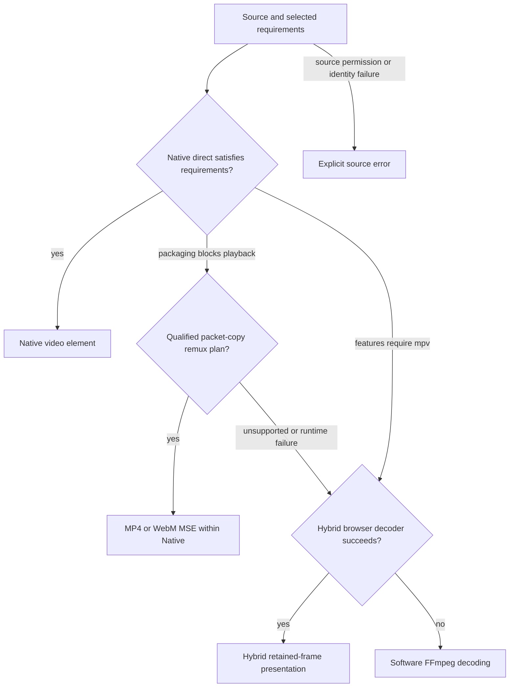

# Routing completion: initial implementation increments

These are functional qualification results for the first two experiments in the
[plan](../../docs/ROUTING-COMPLETION-PLAN.md). They are not release qualification or
a claim of universal FFmpeg/browser support. Existing artifacts and failed attempts
are retained; no commit or push is part of this work.

## Stage 0 and bounded local Files

The [baseline log](baseline.log) records 22 automatic-selection cases, six remux
regressions, 21 API cases and 13 isolated codec/selection cases passing before these
increments. [The baseline manifest](baseline-manifest.json) identifies the starting
sources and engines. [Gates](GATES.md) were recorded before implementation.

[Local-file evidence](LOCAL-FILES.md) records eight passing cases each in Chrome and
Firefox: actual File handles with tail indexes above 4 GiB, forward/backward seeks,
a 259 MB movie, selected-audio preservation through injected Hybrid-to-Software
fallback, 100 queued seeks and worker cleanup. Four isolated reader tests cover
bounds, cancellation, truncation and cancellation during asynchronous cleanup.

## Integration and maintenance

[Packaging results](PACKAGING.md) record eight passing cases each in visible Chrome
and Firefox, including both Vorbis and Opus with VP8 video. Read each run separately;
no CPU improvement or sample-accurate A/V claim follows from these functional gates.

The local reader plugs into the existing I/O worker and native AVIO mailbox. Files
are cloned as handles and read in bounded slices. No mpv source patch or second
source scheduler is introduced. ArrayBuffer input retains its existing size cap.
Reader-owned byte counters exclude browser/OS caches and process memory.

The remux experiment adds audio-only stream selection and FFmpeg WebM output to the
existing worker, while retaining three public modes. The binary registers no
encoders or decoders. MP4 remains preferred where the packet contract fits; WebM
handles VP8/Vorbis and audio-only Opus/Vorbis. Unsupported combinations reject and
automatic selection can continue to Hybrid/Software. No audio conversion, downmix,
codec-core extraction or video conversion is introduced.

FFmpeg `libavformat/matroskaenc.c` is authoritative for WebM cluster flushing,
CodecDelay and track UID behavior. Deterministic IDs avoid `libavutil/random_seed.c`'s
clock-jitter entropy fallback in filesystem-free Wasm. For combined audio/video,
interleaving accounts for the muxer's millisecond-rounded CodecDelay without
removing priming or shifting decoded audio. WebM fragment boundaries flush only
packets already released by the interleaver. These changes use existing FFmpeg
fields/flags; they require no upstream source patch. Keep these contracts covered
when upgrading FFmpeg.

## Open qualification

Stages 3–6 remain open: broader TS and missing-DTS reconstruction, configuration
changes, selective Native ASS/audio adaptation and full platform qualification.
An earlier Hybrid long-movie seek naturally fell back to Software; that timeline
behavior is recorded, not fixed by the File transport change.

Short rendered/headless browser runs do not establish hardware acceleration,
whole-browser CPU/RSS improvements, physical speaker layout, exact A/V drift,
long-duration memory stability, HDR fidelity, mobile behavior or Safari support.
The audio analyser checks decoded non-silence, not physical audio-device output or
sample-accurate priming. Proposed one-hour gates remain unmeasured.

## Reproduction and changed boundaries

```sh
python3 scripts/generate-large-file-fixtures.py
python3 scripts/generate-remux-packaging-fixtures.py
bash scripts/build-remux.sh
npm run build
node --test tests/file-reader.mjs tests/remux-buffering.mjs tests/video-codec-config.mjs tests/native-selection.mjs tests/retained-codec-worker.mjs
node tests/large-files.mjs
BROWSER=firefox node tests/large-files.mjs
HEADLESS=0 node tests/remux-packaging.mjs
HEADLESS=0 BROWSER=firefox node tests/remux-packaging.mjs
npm run test:automatic-selection
node tests/remux-regressions.mjs
node tests/player-api.mjs
node tests/broad-routing.mjs
```

Large-movie fixture preparation and its prerequisites are in [LOCAL-FILES.md](LOCAL-FILES.md).
All generators preserve original media. `DUMP_SEGMENTS=1 CASES=vp8-vorbis.mkv node
tests/remux-packaging.mjs` additionally saves failed append bytes for packet inspection.

| Files | Boundary |
| --- | --- |
| `web/file-reader.js`, `web/io-worker.js` | Bounded, cancellable local File slices through the existing source mailbox |
| `src/internal/wasm-player.ts`, `src/unified-player.ts` | File handle transport; retain ArrayBuffer cap |
| `web/filter-retained-engine-worker.js`, `web/software-full-engine-worker.js` | Accept File initialization through the existing I/O worker |
| `web/native-remux-source-worker.js` | Share the local File reader |
| `native/remux/remux.c`, `web/native-remux-worker.js` | Audio-only stream selection, output container/MIME, WebM clusters, priming-aware ordering and source frame-rate metadata |
| `web/native-remux-player.js` | Bound buffering across leading gaps; reject unfillable forward timeline holes |
| `scripts/build-remux.sh` | Enable WebM, reuse configuration, stage and validate complete Wasm before publication |
| Fixture generators and new tests | Sparse File offsets, real large movie recovery, audio-only/WebM playback and remux buffer regressions |

The fragment producer has an 8 MiB batch limit; MSE retains a single pending append,
uses five seconds of forward buffering and a 12 MiB compressed-byte ceiling. A
future range beyond twelve seconds with insufficient contiguous playback rejects
instead of continuing through a discontinuous source. Source and browser caches
remain separate from these application-owned bounds. FFmpeg frame-rate fields are
copied so WebM can write the source's default frame duration.

## Decisions after these increments

| Candidate | Decision | Remaining promotion gate |
| --- | --- | --- |
| Bounded local File transport | Implemented; retain shared I/O ownership | Longer playback/process-memory trials and additional platforms |
| Audio-only MP4 and WebM packet-copy output | Experiment further with the implemented paths | Exact priming/A/V timing, VFR/long GOPs, repeated visible trials and platform qualification |
| Broader TS and missing DTS repair | Defer to stage 3 | Codec-specific random-access and reorder proof; do not guess DTS |
| Seamless configuration changes | Defer to stage 4 | New initialization, decoder preroll, track identity and cancellation correctness |
| Native ASS and optional audio encoding | Defer to stage 5 | Demonstrated benefit and explicit feature/quality policy |
| Software GPU output, generated-track presentation, Hybrid display effects | Defer | Independent matched visible-playback experiment; preserve exact-filter fallback |

The smallest production architecture remains three modes with one selection owner,
one bounded source contract, Native direct/remux plans, Hybrid browser video decode
and Software decoder fallback. Additional packaging belongs inside Native; it does
not justify another public engine. Preserve explicit mode pins and source failures.

Metric interpretation: `firstPlayableMs` ends when useful MSE buffered data exists;
it is not first photon or first audible sample. `openMs` also includes media-element
readiness. `playToAudibleMs` checks nonzero decoded samples through an AudioContext
analyser. Seek timings include resumed media-time advancement and decoded non-silence.
`remuxMs` is elapsed worker time including initialization/AVIO waits, not process CPU
accounting. Source-byte counters can include repeated reads; a tiny tail-indexed
source may be read entirely during probing even when output remains progressive.
MSE queue depth and generated batch sizes are application counters. Native rendered
and dropped counters are recorded; separate decoder drops, scheduling lateness,
audio underruns and physical A/V error are unavailable in this harness. No decoded
video pixels enter the remux Wasm: browser decoding owns frames and uploads, whose
internal copy counts are not measured.

Failed packaging runs are preserved under their timestamped directories. They
identified initialization entropy blocking, Chromium's rejection of unordered coded
WebM timestamps, leading-gap overproduction, and Firefox gaps at manually/fixed-time
split video clusters. One early Firefox run generated the complete 64-second output
while paused; it is a failure, not evidence of bounded streaming. Later gap-guard
runs failed earlier without draining that source. Final video WebM uses keyframe
boundaries, with an 8 MiB batch limit and at most 24 consecutive empty producer
batches before rejecting an impractical random-access interval. This conservatively
leaves long-GOP qualification open rather than promising universal WebM admission.



Selective Native ASS/audio conversion is still planned, not an implemented edge in
this diagram. Explicit mode selection pins that mode instead of traversing fallbacks.

Final existing-suite reruns passed: [22 automatic-selection cases](automatic-final.log),
[six remux regressions](remux-final.log), [21 API cases](api-final.log), and
[13 broad-routing cases](broad-final.log). [Twenty isolated checks](units-final-20.log)
cover the reader, remux buffering, codec contracts and route selection. These counts
are separate suites, not a combined performance workload.

Additional stage-2 work remains: negotiate alternative compatible output containers
when the initially chosen packaging is rejected, test longer GOPs/VFR and all new
seek/cancel/EOF combinations, measure exact priming and A/V timing, and qualify
additional browsers. The implemented mux choice is deterministic by selected codec;
it does not exhaustively retry every possible browser mux contract.

The [final manifest](final-manifest.json) records source/build hashes, FFmpeg 7.1.1
component counts, fixture sizes/hashes and machine/power state. Sparse fixtures are
identified by generator, original-media hash and logical/allocated sizes without
reading four gigabytes of padding just to hash it. [Fixture metadata](fixture-metadata.json)
records dimensions, frame rates, codecs and audio layout. A [second visible Chrome
trial](PACKAGING.md#repeat-visible-chrome-trial) also passed all eight cases; its
individual timings remain separate from the first trial.
